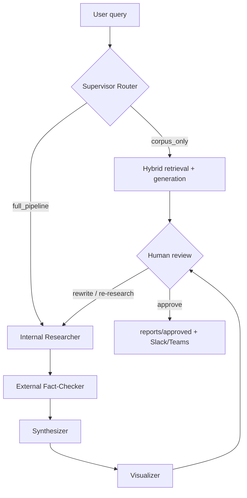

# rag-pipeline-women-safety

An agentic Retrieval-Augmented Generation system for women's safety law and
policy in the European Union — International law · EU framework · Data &
research · NGOs · Helplines · What women can do · Future guidelines.

A five-agent team, coordinated by an LLM router and governed by a
human-in-the-loop review gate, answers policy questions from a 12,863-chunk
corpus of 33 legal and research documents, verifies claims against the live
web, and publishes reviewed reports.

**Full write-up:** [`reports/SCIENTIFIC_REPORT.md`](reports/SCIENTIFIC_REPORT.md)

## Team

DSA 8

1. Prerona Mitra
2. Nihal K P
3. Yogesh S J

---

## Architecture



| Layer | File | What it does |
|---|---|---|
| MCP server | `app/mcp_server.py` | 8 tools: web search, scraping, reports, DB writes, PDF ingest, charts, diagrams, security audit |
| Agent team | `app/agents.py` | 5 agents with role-scoped tool permissions |
| Supervisor + HITL | `app/main.py` | LLM routing, human review gate, publishing |
| Security | `app/security.py` | Prompt injection, data leakage, output validation, SSRF, path traversal |
| Observability | `app/observability.py` | Span tracing, token/cost accounting, prompt-window capture |
| Web UI | `app/app.py` | Gradio interface with PDF upload and feedback logging |
| Teams bot | `app/teams_bot.py` | Microsoft Teams outgoing webhook (HMAC-authenticated) |

### The agents

| Agent | Input | Tools it may call |
|---|---|---|
| Internal Researcher | query | `search_corpus` |
| External Fact-Checker | query + internal summary | `web_search`, `scrape_url` |
| Synthesizer | both research streams | `create_markdown_report` |
| Visualizer | final report | `generate_chart`, `create_mermaid_diagram` |
| Knowledge Updater | new text or PDF | `add_to_database`, `ingest_pdf` |

Permissions are enforced by the dispatcher in code, not by the system prompt —
a prompt injection cannot escalate an agent to a tool it was never granted.

---

## Setup

The system runs **entirely on free, locally-executed models**. No paid API key
is required for any part of the pipeline, the experiments, or the evaluation.

```bash
# 1. Python dependencies
uv sync

# 2. Local model server
brew install ollama          # or see https://ollama.com/download
ollama serve &               # leave running

# 3. Pull the models (≈5 GB total, one-off)
ollama pull llama3.1:8b      # generation, all agents + router + judge
ollama pull nomic-embed-text # embeddings (768-dim)

# 4. Config (optional — defaults already point at local Ollama)
cp .env.example .env
```

Confirm the backend is healthy before running anything:

```bash
uv run python -c "from app import llm; print(llm.describe())"
# OK — ollama · llama3.1:8b · nomic-embed-text @ http://localhost:11434
```

> **iCloud note.** If this repository lives under an iCloud-synced folder
> (e.g. `~/Documents`), create the virtual environment **outside** it —
> otherwise Python imports block indefinitely while iCloud materialises
> evicted `.so` files. Use this everywhere in place of a bare `uv sync`:
>
> ```bash
> UV_PROJECT_ENVIRONMENT=~/.venvs/rag-ws uv sync
> UV_PROJECT_ENVIRONMENT=~/.venvs/rag-ws uv run pytest tests/
> ```
>
> Or export it once per shell: `export UV_PROJECT_ENVIRONMENT=~/.venvs/rag-ws`

### Environment variables

| Variable | Required | Purpose |
|---|---|---|
| `LLM_BACKEND` | no | `ollama` (default) or `openai` |
| `OLLAMA_HOST` | no | default `http://localhost:11434` |
| `OLLAMA_MODEL` | no | default `llama3.1:8b` |
| `OLLAMA_EMBED_MODEL` | no | default `nomic-embed-text` |
| `OPENAI_API_KEY` | no | only if `LLM_BACKEND=openai` |
| `PDF_INPUT_DIR` | no | Source PDFs (default `data/pdfs`) |
| `PDF_OUTPUT_DIR` | no | Index artifacts (default `data`) |
| `SLACK_WEBHOOK_URL` | no | Publish approved reports to Slack |
| `TEAMS_SECURITY_TOKEN` | no | Teams webhook HMAC verification |
| `TRACING_ENABLED` | no | Set `0` to disable tracing (default on) |
| `SECURITY_STRICT_PII` | no | Set `1` to also redact emails/phones |

---

## Running

```bash
# Gradio web app
uv run python app/app.py

# CLI with human review
uv run python app/main.py --query "What is the Istanbul Convention?"

# Skip review, force the full agent pipeline, print the execution trace
uv run python app/main.py \
  --query "Compare the Istanbul Convention and the Victims' Rights Directive" \
  --force-route full_pipeline --visualizer --trace --auto-approve

# Ingest a new PDF into the vector store
uv run python app/main.py --pdf data/pdfs/new_report.pdf

# MCP server standalone
uv run python app/mcp_server.py

# Teams bot (pair with `ngrok http 3978`)
uv run python app/teams_bot.py
```

### Building the index

This repository ships `data/corpus.json` — the **already-extracted text** of all
2,270 pages (6.9M characters). That is what lets a fresh clone build a working
index and reproduce every experiment without the source PDFs, which are not
redistributed here.

```bash
# From the shipped corpus (no PDFs needed) — this is the normal path:
uv run python -m scripts.chunk             # chunk → embed → FAISS + BM25

# Only if you have the source PDFs and want to redo extraction:
#   place them in data/pdfs/ then:
uv run python -m scripts.extract           # PDFs → corpus.json

# Re-embed an existing chunk store without re-extracting the PDFs
# (needed when switching backend: 768-dim local vs 1536-dim hosted)
uv run python -m scripts.reindex --enrich  # + metadata headers
```

Index files are **backend-scoped** (`my_index_ollama.faiss` vs
`my_index.faiss`) so the two embedding widths can never be loaded against the
wrong query vectors.

---

## Experiments

The project's main objective is understanding which design decisions affect
performance. Every experiment below runs locally and free.

```bash
# 1. Where is retrieval recall actually lost? (stage-by-stage attribution)
uv run python -m scripts.diagnose_retrieval

# 2. Design-decision factorial: embedding model × chunk size × overlap ×
#    structure × retriever × k
uv run python -m scripts.experiment_grid --stage chunking
uv run python -m scripts.experiment_grid --stage embedding --output data/exp_embedding.json
uv run python -m scripts.experiment_grid --stage k         --output data/exp_k.json
uv run python -m scripts.experiment_grid --stage structure --output data/exp_structure.json
uv run python -m scripts.experiment_grid --stage all       # full grid

# 3. Retrieval configuration sweep (reranker model, blending, candidate pool)
uv run python -m scripts.experiments

# 3b. Generation model comparison — identical retrieved context per model
uv run python -m scripts.compare_generators
uv run python -m scripts.compare_generators --models llama3.1:8b qwen3.5:4b --limit 8

# 4. Build a larger silver-standard evaluation set from the corpus
uv run python -m scripts.build_ground_truth --n 120

# 5. Regenerate all report figures from the saved results
uv run python -m scripts.make_plots
```

| Script | Question it answers |
|---|---|
| `diagnose_retrieval.py` | Which pipeline stage loses the gold passage? |
| `experiment_grid.py` | How do chunk size, overlap, embedder, structure and k compare? |
| `experiments.py` | Which reranker / blend / candidate-pool setting is best? |
| `compare_generators.py` | Which local generation model answers best from the same context? |
| `build_ground_truth.py` | Silver-standard question set generated from the corpus |
| `make_plots.py` | Figures for the report |

Results land in `data/*.json`; figures in `reports/figures/`. See
[`reports/SCIENTIFIC_REPORT.md`](reports/SCIENTIFIC_REPORT.md) §7 for the
analysis.

**On ground truth.** `data/questions.json` is the hand-written benchmark and is
the headline number. `data/ground_truth_silver.json` is generated *from* corpus
chunks, which makes those chunks artificially easy to retrieve, so it is
reported separately and used only to rank configurations — never merged with
the human set.

---

## Testing

```bash
uv run pytest tests/ -v      # 207 tests
uv run flake8 app/ scripts/ tests/
```

The suite is fully offline — no API key, no network, and no prebuilt index
required — so it runs on a clean checkout and in CI.

| File | Covers |
|---|---|
| `tests/test_security.py` | Injection, leakage, output validation, SSRF, traversal, rate limits |
| `tests/test_observability.py` | Span nesting, cost roll-up, context capture, serialisation |
| `tests/test_mcp_tools.py` | Every MCP tool, including attack paths |
| `tests/test_agents.py` | Tool schemas, dispatch, role permissions, pipeline orchestration |
| `tests/test_hitl.py` | Routing, review branches, publishing |
| `tests/test_rag_core.py` | Chunking, text cleaning, cost ledger |

### Quality evaluation

```bash
uv run python -m scripts.eval        # LLM-as-judge scorecard
uv run python scripts/ragas_eval.py  # faithfulness / precision / recall
```

Current results on a deliberately adversarial 20-question benchmark (11 of 15
scored questions tagged *hard*):

| Metric | Score |
|---|---|
| Retrieval hit rate | 53.3% |
| Generation pass rate | 53.3% |
| RAGAS faithfulness | 0.600 |
| RAGAS context recall | 0.550 |
| RAGAS context precision | 0.432 |

Error analysis in the [scientific report](reports/SCIENTIFIC_REPORT.md#43-error-analysis)
identifies retrieval — specifically on tabular, temporal, and negated queries —
as the binding constraint.

---

## Security

Three threats are addressed, with the tool surface hardened against the
weaknesses that make them exploitable:

- **Prompt injection** — 13 pattern families scanned on every untrusted input:
  web snippets, scraped pages, user PDFs, the user's query, *and* passages
  retrieved from our own vector store. Payloads are neutralised in place rather
  than rejected, so one planted sentence cannot suppress an entire source.
  `add_to_database` is the exception and refuses outright, because a stored
  payload poisons every future retrieval.
- **Data leakage** — 13 secret and PII shapes redacted from reports, messages,
  and trace files. PII rules are off by default (helpline documents legitimately
  contain contact details) and gated behind `SECURITY_STRICT_PII`.
- **Blindly trusting the output** — generated answers are screened for leaked
  secrets, echoed injection markers, empty output, and uncited claims; tool
  arguments are validated against SSRF (including post-redirect) and path
  traversal.

Audit what the guardrails caught with the `security_report` MCP tool, or press
`S` in the review loop.

## Observability

Every run writes `traces/<trace_id>.json` with the full span tree, per-call
token counts and costs, retrieved passages with scores, and the redacted prompt
window at each LLM call. Pass `--trace` for a terminal waterfall:

```
◆ pipeline: Compare the Istanbul Convention and the Victims' …
  ▸ internal_researcher            22084.0ms    9,285t   $0.001923
    ✦ internal_researcher:turn1     3155.1ms    4,202t   $0.000810
    ⚙ dispatch:search_corpus         723.4ms         —           —
  ▸ external_fact_checker          18175.3ms    7,742t   $0.001543
  ▸ synthesizer                    22654.6ms    7,566t   $0.002121
  ▸ visualizer                      5264.2ms    2,086t   $0.000490
  ────────────────────────────────────────────────────────────────
  wall time 67.58s · 4 agents · 9 llm calls · 11 tool calls
  22,820 tokens · $0.005360 · 0 errors
```

Cumulative spend is tracked in `cost_tracker.json` against a $5.00 budget.
