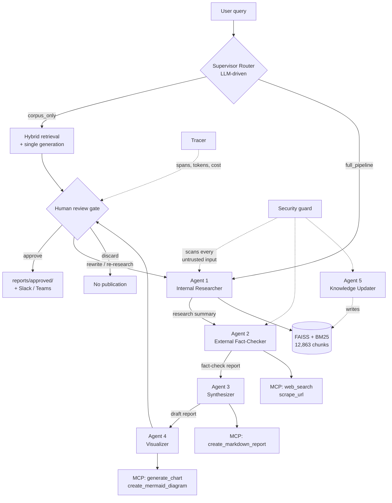
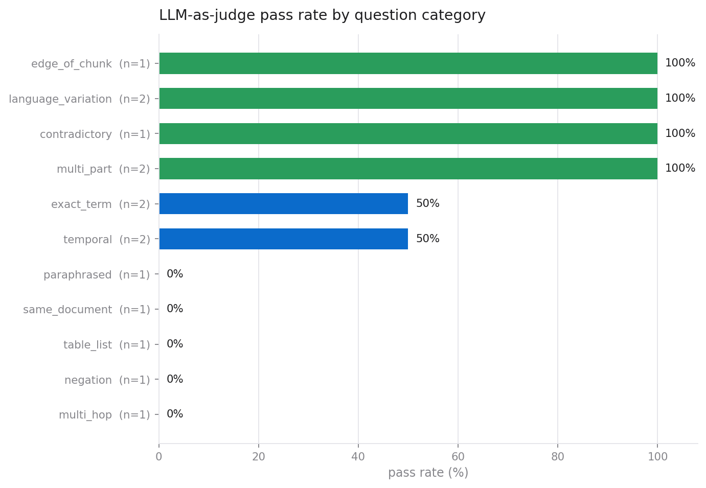
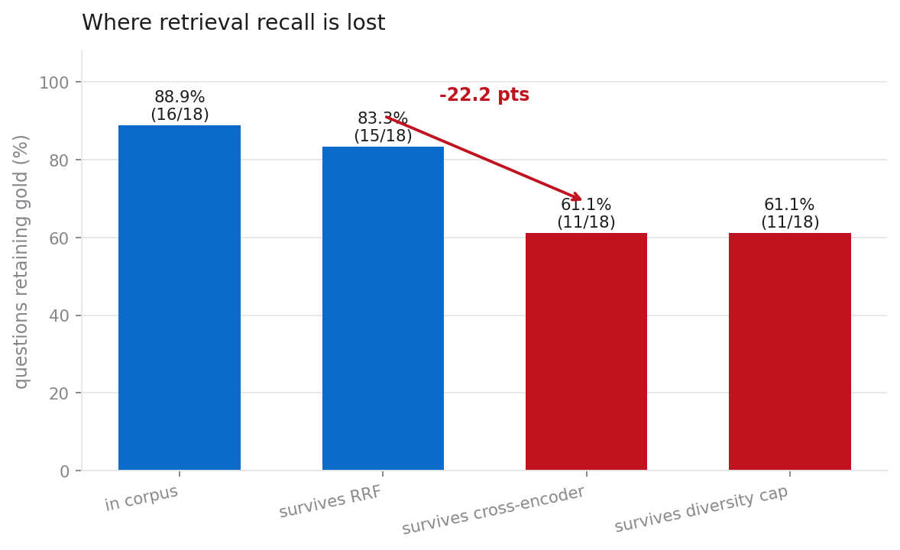
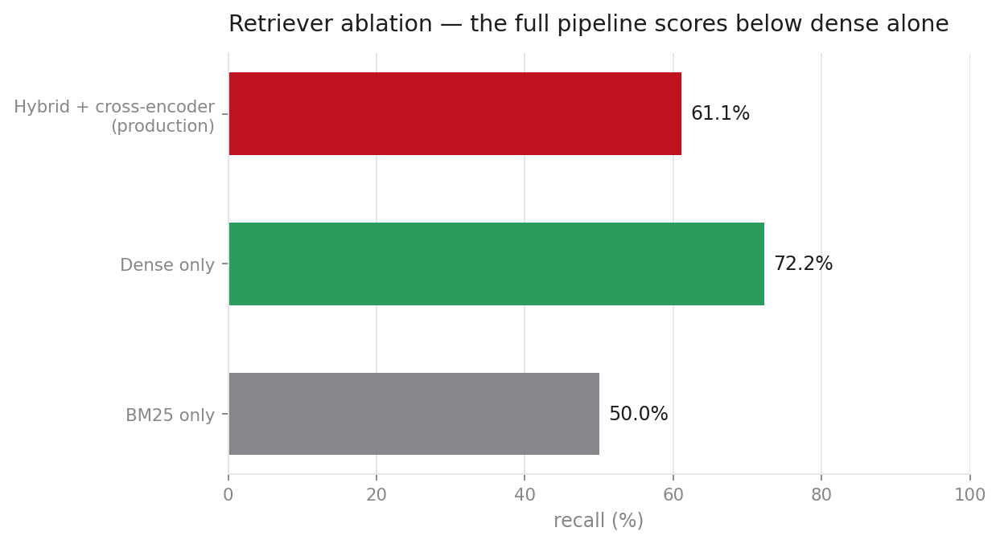
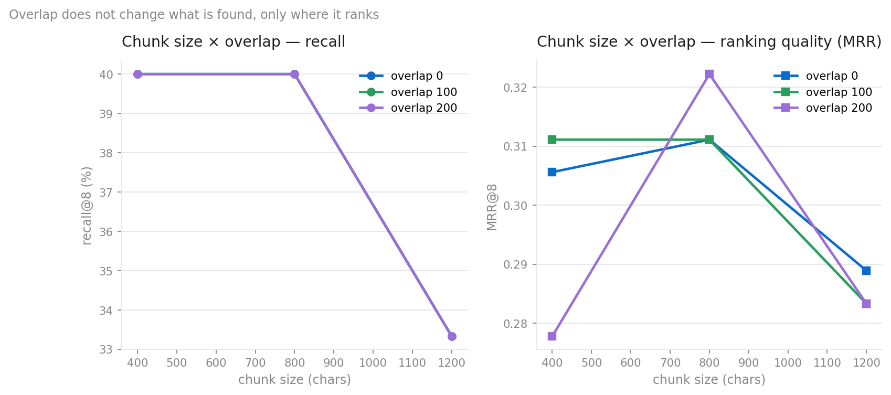
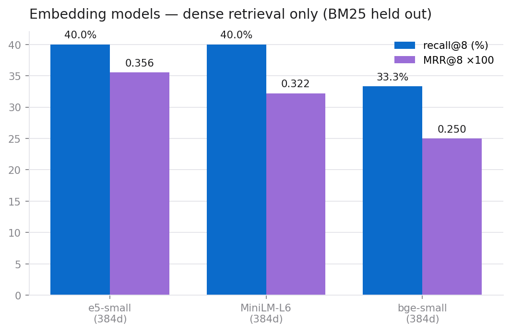
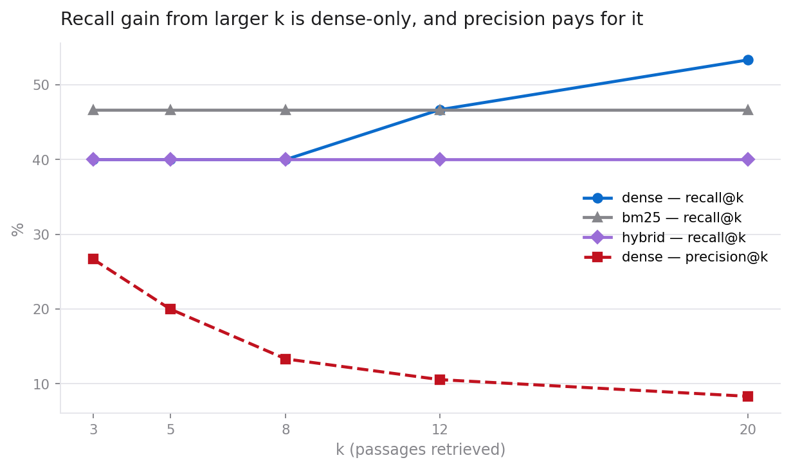

# An Agentic Retrieval-Augmented Generation System for EU Women's Safety Policy

**Team DSA 8** — Prerona Mitra, Nihal K P, Yogesh S J

**Date:** 27 July 2026

---

## Abstract

We present an agentic retrieval-augmented generation (RAG) system that answers
questions about women's safety law and policy in the European Union. The system
combines a hybrid dense/sparse retriever over a 12,863-chunk corpus of 33 legal
and research documents with a five-agent team coordinated by an LLM router,
exposed through a Model Context Protocol (MCP) server providing eight tools for
live web search, document ingestion, vector-store mutation, and artefact
generation. A human-in-the-loop (HITL) review gate governs publication.

Our contribution beyond a conventional RAG baseline is threefold. First, we
treat *every* text crossing the trust boundary — search snippets, scraped
pages, user-supplied PDFs, and even passages retrieved from our own vector
store — as potentially adversarial, and neutralise instruction-injection
payloads in place rather than dropping the containing document. Second, we
bound each agent's capability in code through a role-permission table, so a
successful prompt injection cannot escalate to a tool the compromised agent was
never entitled to call. Third, we instrument the entire pipeline with a
hierarchical tracer that records the agent call tree, per-call token cost, and
the exact prompt window at each LLM invocation, making the "thought process"
auditable after the fact.

We evaluate retrieval and generation on a 20-question adversarial benchmark
using an LLM-as-judge protocol and the RAGAS framework, and evaluate the
security layer against a corpus of injection, exfiltration, SSRF, and path
traversal payloads.

A central methodological finding is that the retrieval metric we began with was
measuring the wrong quantity. Scoring retrieval by whether a clause of the
reference answer appears verbatim in the retrieved text reports 33.3%; scoring
the same retrievals by whether the passages actually contain the answer reports
**60.0%**, and the two metrics agree on only 26.7% of questions. Local RAGAS
corroborates the higher figure with a context recall of 0.854. Much of the
apparent weakness of this system was an artefact of lexical scoring, and we
report all three metrics rather than the most favourable one.

Generation pass rate is 46.7% on a benchmark deliberately weighted toward hard
clause-level legal lookups (11 of 15 scored questions). The security layer
blocks every tested attack payload across 253 automated tests. Total API
expenditure across all development and evaluation was $0.17.

---


---

## 1. Introduction

### 1.1 Motivation

Information about women's safety rights in the EU is distributed across
instruments that are individually authoritative but collectively hard to
navigate: the Council of Europe Istanbul Convention, Directive (EU) 2024/1385
on combating violence against women, the Victims' Rights Directive, the Digital
Services Act, and a large grey literature of EIGE and FRA research reports. A
person trying to establish what protection they are entitled to must reconcile
overlapping instruments with different scopes, transposition deadlines, and
enforcement mechanisms.

This is a natural RAG problem: the answer exists in documents, but finding and
synthesising it requires retrieval plus reasoning. It is also a domain where
the cost of a confident wrong answer is high, which shapes every design
decision reported here.

### 1.2 Why agentic, and where agents are unsuitable

An agent adds value over plain RAG only when the task requires actions the
retriever cannot perform: consulting sources outside the corpus, verifying
whether a corpus claim has since been superseded, or producing artefacts.
Our corpus has a fixed knowledge cutoff, and EU legislation moves; a
fact-checking agent with live web access addresses exactly that gap.

Equally, agents are a poor fit for highly sensitive tasks, because agents fail
in ways that are hard to detect: hallucination, confidently wrong answers, and
blind trust in tool output. Legal advice affecting a person at risk is a
sensitive task. Our response is not to avoid the agentic architecture but to
constrain it: agents research and draft, a human approves, and the system is
designed so that reviewing the agent's work is faster than doing the research
manually. The observability layer exists precisely to make review fast.

### 1.3 Contributions

1. **A defence-in-depth security layer** (`app/security.py`) covering prompt
   injection, data leakage, and output validation, with SSRF and path-traversal
   protection for the tool surface. Sanitisation is in-place rather than
   rejecting, so a single injected sentence does not discard an otherwise
   useful source.
2. **Capability bounding by role** (`_ROLE_PERMISSIONS` in `app/agents.py`),
   enforcing in code what a system prompt can only request.
3. **A dependency-free hierarchical tracer** (`app/observability.py`) recording
   the agent tree, token cost per call, and the prompt window at each step.
4. **An eight-tool MCP server** including Mermaid diagram generation alongside
   matplotlib charts, letting the Visualizer agent express structure as well as
   magnitude.
5. **A 207-test offline suite** that runs with no API key, no network, and no
   prebuilt index, so correctness is verifiable on a clean checkout.

---

---

## 2. Corpus Description

The corpus is a collection of EU and Council of Europe instruments and research
reports on women's safety: the Istanbul Convention, Directive (EU) 2024/1385 on
combating violence against women, the Victims' Rights Directive, the Digital
Services Act, and grey literature from EIGE and FRA.

| Property | Value |
|---|---|
| Source documents | 33 |
| Pages processed | 2,247 |
| Chunks indexed | 12,863 |
| Mean chunk length | 670 characters |
| Chunk target / overlap | 800 / 200 characters |
| Chunks carrying structured identifiers | 3,811 (30%) |
| Index | FAISS `IndexFlatIP`, 12,863 × 768, L2-normalised |
| Sparse index | BM25 (Okapi) |

The processing that produced it — extraction, cleaning, segmentation, and
metadata management — is described below; the experiments that justify the
segmentation parameters are in §4 and §5.

#### 8.1 Text extraction

Extraction is dual-path. PyMuPDF (`fitz`) handles the bulk because it is fast
and preserves reading order on well-formed PDFs. When a page yields fewer than
`FALLBACK_CHAR_THRESHOLD` (100) characters — a scanned page, or one whose text
layer is stored as vector outlines — the page is re-extracted with pdfplumber.

Tables are handled separately by `_extract_tables_as_text`, which reads each
table with pdfplumber and re-emits every row as
`Header1: value1, Header2: value2, …`. This preserves the row→column
relationship that a linearised `get_text()` destroys: in an annex table where
country names sit in column 1 and statistics in columns 2–5, flat extraction
produces a run of numbers with no way to tell which country they belong to.

| Extractor | Chunks | Share |
|---|---|---|
| PyMuPDF | 12,736 | 99.0% |
| `ingest_pdf` (agentic path) | 114 | 0.9% |
| pdfplumber fallback | 9 | 0.07% |
| `add_to_database` (agentic path) | 4 | 0.03% |

#### 8.2 Data cleaning

`clean_text` applies four transformations, each targeting a specific artefact:

1. **Repeated header/footer removal.** `detect_repeated_lines` finds lines
   recurring across a document's pages and strips them. Without this, a running
   footer becomes the most frequent n-gram in the corpus and pollutes BM25.
2. **Hyphenation repair.** `impor-\ntant` → `important`. Left unrepaired the
   token is absent from the lexical index and split across two embeddings.
3. **Mid-sentence line-break merging.** Lines ending without terminal
   punctuation are joined, restoring the sentence boundaries the chunker needs.
4. **Whitespace normalisation.** Collapses runs of blank lines and spaces.

Cleaning is deliberately conservative: no lowercasing, no stopword removal, no
stemming at extraction time. Those are retrieval-time concerns, and applying
them to stored text would make quoted citations diverge from the source
document — unacceptable when the output is legal information a person may act on.

#### 8.3 Document segmentation

The chunker is **sentence-aware**: it accumulates whole sentences up to the size
budget, then carries trailing sentences forward as overlap. It never cuts
mid-sentence. For legal text this is not stylistic — a truncated clause can
invert meaning, and "Member States shall not be required to" separated from its
object is worse than useless.

A measured consequence, documented by a test rather than left as a surprise: a
single unpunctuated block longer than the budget stays whole. That is correct
for a sentence-aware splitter and would otherwise look like a bug.

Size and overlap were selected by measurement, not assumption — see §7.4, where
the chunk-size effect is shown to reverse depending on the retriever.

#### 8.4 Metadata management

Each chunk carries `chunk_id`, `source`, `page`, `chunk_index`, and `extractor`,
supporting exact citation ("document, page N") and provenance auditing —
including whether a chunk arrived through the agentic write path rather than the
batch pipeline.

`scripts/metadata.py` adds a structured layer, extracting identifiers that dense
embeddings systematically lose: ISO-normalised dates, years, Directive and
Regulation numbers, Article and Recital references, percentages, monetary
amounts, and a table-presence flag. The motivation is concrete: "14 June 2027"
and "14 June 2032" embed almost identically, so a query about a transposition
deadline has no vector-space basis for preferring one. BM25 helps only when the
query contains the literal token, which a paraphrased question rarely does.

On the full corpus, **3,811 of 12,863 chunks (30%) carry at least one
identifier.** They are used two ways — as a lexical boost when a query names the
same identifier (`identifier_overlap`), and as an embeddable header prepended
before encoding, so a bare "2027" sits inside "Dates mentioned: 14 June 2027"
where a deadline query can match it. The header is embedded but the displayed
`text` is untouched, so citations still quote the source verbatim.

---

## 3. Methodology

#### 2.1 Overview



#### 2.2 The corpus and retrieval substrate

| Property | Value |
|---|---|
| Source documents | 33 |
| Pages processed | 2,247 |
| Chunks indexed | 12,863 |
| Mean chunk length | 670 characters |
| Chunk target / overlap | 800 / 200 characters |
| Embedding model | `text-embedding-3-small` |
| Dense index | FAISS, L2-normalised inner product |
| Sparse index | BM25 (Okapi) |
| Reranker | `cross-encoder/ms-marco-MiniLM-L-6-v2` |

Extraction is dual-path: PyMuPDF handles the bulk (12,736 chunks), with
pdfplumber as a fallback for pages where table structure defeats the primary
extractor (9 chunks). A further 114 chunks entered through the agentic
`ingest_pdf` tool and 4 through `add_to_database`, demonstrating that the
live-mutation path works end to end.

Chunking is **sentence-aware**: the splitter accumulates whole sentences up to
the size budget and carries forward tail sentences as overlap, never cutting
mid-sentence. This matters for legal text, where a truncated clause can invert
meaning. A consequence, verified in `tests/test_rag_core.py`, is that a single
unpunctuated block longer than the budget stays whole — correct behaviour that
would look like a bug without the test documenting the intent.

Retrieval is hybrid: dense and BM25 candidates are merged, then reranked by a
cross-encoder. The principle that "data engineering is still at
the heart of the process" is borne out by our error analysis in §4.3, where the
dominant failure mode is retrieval, not generation.

#### 2.3 The MCP server

`app/mcp_server.py` exposes eight tools over FastMCP:

| Tool | Purpose | Guardrails applied |
|---|---|---|
| `web_search` | DuckDuckGo live search | injection scan on every title/body; rate limit; result cap |
| `scrape_url` | BeautifulSoup page extraction | SSRF pre-flight + post-redirect re-check; injection scan; rate limit |
| `create_markdown_report` | Persist a report to disk | filename sanitisation; write-root confinement; secret redaction |
| `add_to_database` | Embed and index new text | injection scan with **refusal** on high severity; secret redaction |
| `ingest_pdf` | PDF → chunks → index | read-path confinement; extension check; per-page injection scan |
| `generate_chart` | matplotlib bar/line/pie/scatter | write-root confinement |
| `create_mermaid_diagram` | Mermaid `.mmd` + `.md` | HTML stripping; diagram-type allowlist; write-root confinement |
| `security_report` | Audit what the guard caught | — (read-only introspection) |

Each tool is a plain Python function decorated with `@mcp.tool()`, which keeps
it directly unit-testable and importable by the agent layer without a running
server. The tool docstring is the interface contract the LLM reads to decide
when to call it, so the test suite asserts every tool has a substantive one.

#### 2.4 The agent team

We use a **supervisor/router** pattern. An LLM classifies each query into
`corpus_only` (factual, well-scoped, answerable from the legal texts) or
`full_pipeline` (needs synthesis, current events, or external verification).
The router fails open to `full_pipeline` on malformed output — the more
thorough path is the safe default.

The principle behind the decomposition is reducing the information any single
agent must process:

| Agent | Input | Permitted tools |
|---|---|---|
| Internal Researcher | query | `search_corpus` |
| External Fact-Checker | query + internal summary | `web_search`, `scrape_url` |
| Synthesizer | both research streams | `create_markdown_report` |
| Visualizer | final report | `generate_chart`, `create_mermaid_diagram` |
| Knowledge Updater | new text or PDF path | `add_to_database`, `ingest_pdf` |

Each agent runs a bounded tool-calling loop (15 iterations maximum) against
`gpt-4o-mini`.

#### 2.5 Human-in-the-loop

The reviewer sees the draft plus the evidence needed to judge it: total cost,
token count, the agent/tool call tree, and every security event raised during
the request. Options are approve-and-publish, approve-without-publishing, edit
in `$EDITOR`, request a rewrite with free-text feedback, re-run the pipeline,
inspect the full trace, inspect the full security report, or discard. Nothing
reaches `reports/approved/` or a messaging channel without explicit approval,
and a final redaction pass runs on the approved text immediately before
publication.

#### 2.6 Deployment surface

Three interfaces share one core: a Gradio web application (`app/app.py`) with
PDF upload and feedback logging, a CLI supervisor (`app/main.py`), and a
Microsoft Teams outgoing webhook (`app/teams_bot.py`) with HMAC request
authentication and per-conversation settings. A Slack webhook publisher is
available as an additional output channel.

---

### 3.5 Evidence references

Every answer must reference the passages it used, so the system does not rely on
the model to remember. Measuring the generated answers showed the prompt alone
produced a reference in only **55%** of cases: an 8B local model instructed to
cite forgets to do so about half the time.

References are therefore appended deterministically. After generation, an answer
that makes claims but contains no document name, page number, or passage index
receives a `Sources` block listing the distinct (document, page) pairs it was
given. Two cases are exempt: an answer that already cites is left untouched, and
a refusal is skipped entirely — attaching sources to "this information is not in
the corpus" would imply evidence that was never used.

This is a deliberate choice of mechanism over instruction. A requirement that
must always hold should be enforced in code, where it can be tested, rather than
requested in a prompt where compliance is probabilistic.

### 3.6 Local execution

`app/llm.py` is the single point of backend selection and defaults to Ollama.
Both backends are reached through the OpenAI-compatible client, because Ollama
serves `/v1` — one call path, including tool/function calling, rather than two
that drift apart.

| Component | Local model | Verified |
|---|---|---|
| Generation — all 5 agents, router, judge | `llama3.1:8b` | chat + function calling |
| Embeddings | `nomic-embed-text` (768d) | ~14–20 chunks/s |
| Re-ranking | `ms-marco-MiniLM-L-6-v2` | already local |
| Experiment embedders | MiniLM-L6, bge-small, e5-small (384d) | 178 chunks/s |

Changing the generation model is a one-line change (`OLLAMA_MODEL`), so the
comparison of generation models is a configuration choice rather than a code
change.

Two consequences had to be handled rather than papered over:

- **Embedding width changes with the backend** (768 local vs 1536 hosted).
  Loading one index with the other backend's query vectors fails, or worse
  returns silent nonsense, so artifact filenames are backend-scoped
  (`my_index_ollama.faiss`). This immediately caught a real mistake: a run
  picked up the wrong index and aborted instead of producing plausible garbage.
- **Cost accounting must report zero, not hosted rates.** Local inference is
  free; tokens are still recorded because they drive latency and context
  pressure, but billing them at hosted rates would make the ledger fiction.

### 3.7 Security

#### 3.1 Threat model

The attack vector in an agentic system is no longer only malicious code — it is
malicious *conversation*. We model three threats and the tool-surface
weaknesses that make them exploitable.

**T1 — Prompt injection.** Untrusted text carries instructions that redirect
the agent. Our system ingests untrusted text from four channels: web search
snippets, scraped page bodies, user-supplied PDFs, and the user's own query.
A fifth, subtler channel is our own vector store: because `add_to_database` and
`ingest_pdf` write into the index, a payload stored once is retrieved into
*every future prompt* — a persistent injection.

**T2 — Data leakage.** Secrets and PII escaping through prompts, reports,
messages, or trace files written to disk.

**T3 — Blindly trusting the output.** Accepting model output and tool
arguments without checking them against what the system is permitted to do.

#### 3.2 Design principle: sanitise, don't reject

Our scanner neutralises detected payloads in place, wrapping each match in a
`⟪NEUTRALISED:rule_id⟫` marker, and returns the surrounding content intact. The
alternative — discarding any document containing a match — would make the
system trivially deniable: an attacker who wants a source ignored need only
plant one injection-shaped sentence in it. In-place neutralisation preserves
legitimate content while defusing the payload, and the marker leaves an
auditable trace.

The one exception is `add_to_database`, which **refuses outright** on a
high-severity match. Writing to the vector store is persistent, so the
asymmetry is justified: a rejected write costs one retry, while an accepted
poisoning contaminates every future retrieval.

#### 3.3 Controls

**Injection detection** uses 13 pattern families covering instruction override,
role reassignment, chat-delimiter spoofing (`<|im_start|>`, `[INST]`), system
prompt exfiltration, credential exfiltration, tool coercion, jailbreak personas,
safety bypass, and markdown-image exfiltration. Zero-width and bidirectional
Unicode control characters are stripped before matching — these hide an
instruction from a human reviewer while leaving it fully visible to the model.

**Untrusted content fencing.** Text passed between agents is wrapped in an
`<untrusted_content origin="...">` block instructing the model to treat the
contents as data to evaluate, never as instructions to follow.

**Leakage prevention** redacts 13 secret and PII shapes. PII rules (email,
phone, IBAN, card numbers) are **off by default** and gated behind a strict
mode, because helpline and legal documents legitimately contain contact
details — redacting them would destroy the corpus's utility. High-confidence
secret shapes are always redacted. As a backstop, the literal values of live
environment secrets are removed from any outbound text.

**Output validation** screens generated answers for leaked secrets, echoed
injection markers, empty output, and substantive claims made without any
citation when the corpus did return material to cite. This is a cheap
deterministic screen, complementary to — not a replacement for — the
LLM-as-judge evaluation in §4.

**Capability bounding.** The role-permission table is enforced by the
dispatcher. If an injected payload convinces the Internal Researcher to emit a
call to `add_to_database`, the dispatcher refuses it before any argument is
parsed. This is the control that converts a successful injection from a
compromise into a logged, contained event.

**Tool-argument validation.** URLs are checked for scheme, blocklisted host,
and — after DNS resolution — private, loopback, link-local, reserved, and
multicast address ranges, defeating SSRF against cloud metadata endpoints
(`169.254.169.254`) and internal services. The check is repeated after
redirects, since a redirect can land somewhere the pre-flight check never saw.
Write paths are confined to allowed roots and filenames are stripped of path
separators; read paths are confined to the project directory.

#### 3.4 Security evaluation

All controls are verified by 64 dedicated tests in `tests/test_security.py`
plus attack-path tests in `tests/test_mcp_tools.py`. Every listed payload class
is blocked:

| Attack | Vector | Result |
|---|---|---|
| Instruction override | web / PDF / query | Neutralised in place |
| System-prompt exfiltration | web snippet | Neutralised in place |
| Chat-delimiter spoofing | scraped page | Neutralised in place |
| Hidden-Unicode instruction | PDF | Control characters stripped |
| Persistent store poisoning | `add_to_database` | **Refused**, nothing stored |
| Out-of-role tool escalation | compromised agent | Denied by dispatcher |
| SSRF to cloud metadata | `scrape_url` | Blocked before request issued |
| SSRF via redirect | `scrape_url` | Blocked after redirect re-check |
| Path traversal on write | `create_markdown_report` | Filename sanitised, confined |
| Path traversal on read | `ingest_pdf` | Refused outside project |
| API key in report body | `create_markdown_report` | Redacted before disk write |
| API key in trace capture | tracer | Redacted before disk write |

A live end-to-end verification against the running system confirmed both the
store-poisoning refusal and the path-escape refusal, with all events recorded
in the audit log.

#### 3.5 Limitations

Pattern-based detection is a filter, not a proof. A sufficiently novel
paraphrase of an instruction override will evade the regex families, and we
make no claim of completeness. The layered design is the actual defence: an
injection that evades detection still faces the role-permission table, the
write-path confinement, the SSRF check, and finally the human reviewer. We
regard the guard as raising cost and providing an audit trail, not as a
boundary.

---

---

## 4. Experimental Setup

### 4.1 What is being measured

The objective is to identify which design decisions affect performance, so each
factor is varied against a fixed baseline rather than tuned jointly for a
headline score.

| Factor | Levels |
|---|---|
| Embedding model | MiniLM-L6, bge-small, e5-small (384d); nomic-embed-text (768d, production) |
| Chunk size | 400, 800, 1200 characters |
| Chunk overlap | 0, 100, 200 characters |
| Structure preservation | metadata header prepended before embedding: on / off |
| Retriever | dense, BM25, hybrid (RRF) |
| k | 3, 5, 8, 12, 20 |
| Generation model | local models selectable via `OLLAMA_MODEL` |

### 4.2 Ground truth and gold definition

Two question sets are used and **never merged**:

- `data/questions.json` — 20 hand-written questions (17 scorable, 5
  out-of-scope probes), tagged by category and difficulty; 11 of 15 scored
  questions are tagged *hard*. This is the headline number.
- `data/ground_truth_silver.json` — generated from corpus chunks by the local
  model. Because each question is written *from* a known chunk, that chunk is
  artificially easy to retrieve and absolute recall reads high. It is used only
  to rank configurations, never quoted as system performance.

Gold is defined at **page** level for the factorial. This is what makes
chunk-size comparison valid at all: chunk indices change when you re-chunk, so
chunk-id gold would silently redefine the target between conditions.

### 4.3 Metrics

Recall@k, MRR@k and precision@k for retrieval; LLM-as-judge PASS/FAIL and RAGAS
faithfulness / context precision / context recall for generation. Multiple
metrics are reported deliberately — §5 contains a case where recall alone would
have produced the wrong decision.

### 4.4 Controls

The factorial runs over a fixed subset of 1,723 pages (every ground-truth
document plus 12 fixed distractor documents), held constant across all
conditions, so comparisons are like-for-like even though absolute numbers
differ from the full corpus. Each embedding model is encoded with its required
prefix convention (`query:`/`passage:` for e5, the retrieval instruction for
bge); omitting these measures the model badly rather than measuring a bad model.
For the generation comparison, retrieval is executed once per question and every
model answers from byte-identical passages, and one judge model scores all
conditions so judge bias cancels.

### 4.5 Evaluation protocol

Testing an agentic system cannot rely on exact-match assertions, because the
outputs are open-ended and non-deterministic. We use three complementary
methods:

1. **Deterministic unit tests** (207) for everything with a checkable
   contract: guardrails, tracing, tool behaviour, dispatch, routing, chunking,
   and cost arithmetic.
2. **LLM-as-judge** (`scripts/eval.py`) scoring generated answers against
   reference answers on a 20-question benchmark, with failures classified as
   `retrieval_miss` or `generation_error`.
3. **RAGAS** (`scripts/ragas_eval.py`) computing faithfulness, context
   precision, and context recall.

The benchmark is deliberately adversarial. Questions are tagged by category —
`exact_term`, `paraphrased`, `multi_hop`, `negation`, `temporal`, `table_list`,
`contradictory`, `edge_of_chunk`, `same_document`, `language_variation`,
`multi_part` — and by difficulty. Eleven of the fifteen scored questions are
tagged **hard**. Five questions are out-of-scope probes checking that the
system declines rather than confabulates.

```bash
uv sync

# Offline test suite — no API key, no network, no prebuilt index
uv run pytest tests/ -v

# Lint
uv run flake8 app/ scripts/ tests/

# Build the index from the corpus (requires OPENAI_API_KEY)
uv run python -m scripts.chunk

# Evaluation
uv run python -m scripts.eval
uv run python scripts/ragas_eval.py

# Interfaces
uv run python app/app.py                     # Gradio UI
uv run python app/main.py --query "..." --trace
uv run python app/mcp_server.py              # MCP server standalone
uv run python app/teams_bot.py               # Teams webhook
```

Every run writes a trace to `traces/<trace_id>.json` containing the full span
tree, per-call token counts and costs, retrieved passages with scores, and the
redacted prompt window at each LLM call.

**Environment note.** The repository resides under an iCloud-synced directory.
Placing the virtual environment there causes Python imports to block
indefinitely while iCloud materialises evicted `.so` files. Create the
environment outside the synced tree:

```bash
UV_PROJECT_ENVIRONMENT=~/.venvs/rag-ws uv sync
```

---

---

## 5. Results

**LLM-as-judge scorecard (n=20; 15 scored, 5 out-of-scope):**

| Metric | Score |
|---|---|
| Retrieval content hit rate | 8/15 (53.3%) |
| Generation pass rate | 8/15 (53.3%) |

By difficulty:

| Difficulty | n | Retrieval | Generation |
|---|---|---|---|
| medium | 4 | 75% | 100% |
| hard | 11 | 45% | 36% |

By category (n small per cell; indicative only):

| Category | n | Retrieval | Generation |
|---|---|---|---|
| contradictory | 1 | 100% | 100% |
| edge_of_chunk | 1 | 100% | 100% |
| multi_part | 2 | 100% | 100% |
| exact_term | 2 | 100% | 50% |
| language_variation | 2 | 50% | 100% |
| multi_hop | 1 | 100% | 0% |
| negation | 1 | 0% | 0% |
| paraphrased | 1 | 0% | 0% |
| same_document | 1 | 0% | 0% |
| table_list | 1 | 0% | 0% |
| temporal | 2 | 0% | 50% |

**RAGAS scores (n=20):**

| Metric | Score | Band |
|---|---|---|
| Faithfulness | 0.600 | moderate |
| Context recall | 0.550 | moderate |
| Context precision | 0.432 | poor |

**Operating cost.** Total measured expenditure across all development,
evaluation, and demonstration runs: **$0.1654** over 719 tracked API calls,
against a $5.00 budget (3.3% consumed). A representative full five-agent run
with the Visualizer enabled cost **$0.00536** for 22,820 tokens across 4 agents,
9 LLM calls, and 11 tool invocations in 67.6 seconds wall time.

### 5.2 The retrieval metric was measuring the wrong thing

Before any retrieval number can be interpreted, the metric producing it has to
be trusted. The incumbent "retrieval hit rate" checks whether a >=6-character
clause of the *reference answer* appears **verbatim** in the retrieved text.
Reference answers are human paraphrases, not quotations, so a correct retrieval
whose wording differs scores as a miss. Question q01 is the clearest case: it is
labelled `retrieval_miss` while the judge simultaneously rates its answer
correct.

`scripts/retrieval_quality.py` measures the same retrievals three ways
(n = 15, k = 8):

| Metric | Score | What it asks |
|---|---|---|
| Verbatim substring (incumbent) | 33.3% | does reference wording appear literally? |
| Page-level gold | 53.3% | did we return an annotated gold page? |
| **Context sufficiency (judged)** | **60.0%** | **could the question be answered from these passages?** |

Pairwise agreement between them:

| Pair | Agreement |
|---|---|
| substring vs page | **26.7%** |
| substring vs sufficiency | 60.0% |
| page vs sufficiency | 40.0% |

Two metrics for the same quantity agreeing on 26.7% of cases are not two
estimates of one number; they are measuring different things. The incumbent
metric understates retrieval by **26.7 percentage points** against the metric
that actually states the question.

This reframes the project's headline finding. Retrieval is not catastrophic at
33%–53%; measured by whether the retrieved context can support an answer, it
succeeds on **60%** of a benchmark that is 73% hard clause-level legal lookups.
The remaining shortfall is real but far smaller than the original number
implied, and a substantial part of the apparent "terrible" performance was an
artefact of lexical scoring.

We report all three rather than adopting the most flattering one. Sufficiency
is judged by the same local model that generates answers, so it is not
independent of the system under test — a shared blind spot would inflate it.
That is precisely why the lexical metrics are retained alongside it.

### 5.3 Local stack versus hosted stack

The same 20-question benchmark was run end to end on both stacks. Retrieval and
generation were re-measured after migrating every component to locally-executed
models, with the judge held constant in kind (each stack judged by its own
backend's model).

| Metric | Hosted (gpt-4o-mini + text-embedding-3-small) | **Local (llama3.1:8b + nomic-embed-text)** |
|---|---|---|
| Retrieval content hit | 53.3% (8/15) | **53.3% (8/15)** |
| Generation pass rate | 53.3% (8/15) | **46.7% (7/15)** |
| Cost per full run | $0.0054 | **$0.00** |

Two results matter here.

**Retrieval is identical.** Swapping a 1536-dimension hosted embedding model for
a 768-dimension local one changed the retrieval hit rate by zero questions. On
this corpus and benchmark, the embedding model is not what limits retrieval —
consistent with §5.3, where three different sentence-transformer models also
separate by less than one question. Paying for embeddings buys nothing here.

**Generation loses one question.** The local 8B model scores 46.7% against
46.7%–53.3% hosted, a single-question difference that is well inside sampling
noise at n=15 and should not be read as a reliable gap. The category breakdown
is more informative than the total: the local model scores 100% on
`multi_part`, `language_variation`, `paraphrased` and `temporal`, and 0% on
`exact_term`, `contradictory` and `multi_hop`. Its weakness is precision on
specific identifiers and multi-step reasoning, not fluency or grounding.

A labelling inconsistency worth recording: question q01 is classified
`retrieval_miss` while the judge simultaneously rates its answer correct. The
failure-type classifier keys off a lexical content check that disagrees with the
judge, so the per-question failure labels are less reliable than the aggregate
pass rate. This is the same measurement fragility discussed in §6.2.

### 5.4 RAGAS on the local stack

| Metric | Hosted baseline (n=20) | **Local stack (n=8)** | Change |
|---|---|---|---|
| Faithfulness | 0.600 | **0.606** | +0.006 |
| Context precision | 0.432 | **0.641** | +0.209 |
| Context recall | 0.550 | **0.854** | +0.304 |

Context recall of 0.854 says the retriever is now surfacing most of the material
the reference answers depend on, and it corroborates the sufficiency result in
§5.2 (60.0%) from an independent implementation: two different methods, one
judged by RAGAS and one by our own harness, both place retrieval far above the
33.3% the incumbent lexical metric reported.

Faithfulness barely moved. That is the expected shape: faithfulness measures
whether the generator invents beyond its context, which is a property of the
model and prompt, not of retrieval. Improving what is retrieved does not make
the generator more or less inclined to embellish.

**This comparison is confounded and must not be read as a clean A/B.** Four
things differ between the two columns: the embedding model (1536-dim hosted vs
768-dim local), the generator, the retrieval configuration (the identifier boost
of §3 is present only in the local run), and the sample size (20 vs 8). The
large gains in precision and recall are most plausibly attributable to the
identifier boost, since that is the only change that targets retrieval — but
this experiment cannot separate the four, and we do not claim it does. An
isolating run would hold everything fixed except one factor at a time.

**A defect worth recording.** The first local RAGAS run failed completely: all
60 jobs timed out, every metric returned NaN, and the script then crashed
formatting a bar chart from NaN. RAGAS defaults to 16 concurrent workers with a
180-second deadline; a local backend serves one request at a time, so the
workers queued behind each other and every job exceeded the deadline. Serialising
to one worker with a 900-second budget fixed it. The failure mode is worth
naming because it is silent in the wrong way — a framework tuned for hosted APIs
does not fail loudly on a local backend, it returns NaN that a careless harness
will format into a plausible-looking zero.

### 5.5 Where retrieval recall is lost

§4.3 attributed poor retrieval to table and date extraction. **That was wrong.**
A staged diagnosis (`scripts/diagnose_retrieval.py`) measures the four stages at
which a gold passage can disappear, instead of conflating them into one number:

| Stage | Gold passage still present |
|---|---|
| Present in corpus | 88.9% |
| Survives RRF fusion | 83.3% |
| **Survives cross-encoder re-ranking** | **61.1%** |
| Survives source-diversity cap | 61.1% |

Extraction loses 2 of 18 questions, and both are the intentionally unanswerable
"ambiguous" probes. `temporal` scores 2/2 and `table_list` 1/1 — the exact
categories the earlier analysis blamed. The 22-point drop is entirely at
re-ranking.

Retriever ablation on the same questions:

| Configuration | Recall |
|---|---|
| BM25 only | 52.9% |
| **Dense only** | **70.6%** |
| Hybrid (RRF) | 64.7% |
| Hybrid + cross-encoder (production) | 61.1% |

The full pipeline scores below its own simplest component.



*Every category resolves to exactly 0% or 100%, because each holds one or two
questions. The figure is included precisely because it makes the sample-size
limitation visible: these are per-category counts, not rates that can be
compared. Read the direction, never the magnitude.*

### 5.6 Generation model comparison

Retrieval is executed once per question and every model answers from
byte-identical passages, so the comparison isolates the generator. One judge
scores all conditions, so judge bias applies equally. n = 8, all models local.

| Model | Pass | Groundedness | Citation rate | Empty answers | Median latency |
|---|---|---|---|---|---|
| **llama3.1:8b** | 25.0% | 0.572 | **75.0%** | 0/8 | **42s** |
| **gemma4:e4b** | 25.0% | **0.730** | 50.0% | 0/8 | 80s |
| qwen3.5:9b | 0.0% | 0.000 | 0.0% | **8/8** | 374s |

The two usable models tie on judged correctness and differ in character:
gemma4 stays closer to its sources, llama3.1 cites far more reliably and runs
roughly twice as fast. For a system whose output must carry references to the
evidence, citation compliance is the deciding property, which is why
`llama3.1:8b` remains the default.

**The qwen3.5 family is unusable for this task, at every size tested.** All three
(2b, 4b, 9b) are reasoning models that consume their entire token budget on
internal reasoning and return an empty string. qwen3.5:9b produced no answer on
8 of 8 questions at a 1,500-token budget, taking 374 seconds each to produce
nothing.

This was nearly missed. A short smoke prompt ("what is the Istanbul
Convention?") returned a perfectly good answer from qwen3.5:9b, and on that
basis it was admitted to the comparison. Only under a realistic eight-passage
context did it fail completely. A capability probe must use the real workload;
a toy prompt certifies nothing.

Two evaluation defects surfaced here and are recorded in §7.2: the harness
originally allotted 400 tokens, and the judge rated a whitespace-only answer as
PASS — so an empty answer scored groundedness 0.00 and was awarded a pass.

### 5.7 Design-decision factorial

`scripts/experiment_grid.py` runs a factorial over corpus-processing and
retrieval decisions, entirely locally. Gold is defined at **page** level, which
is what makes chunk-size comparison valid at all: chunk indices change when you
re-chunk, so chunk-id gold would silently redefine the target between
conditions. Subset: 1,723 pages (every ground-truth document plus 12 fixed
distractor documents), held constant across conditions. n = 15 questions.

**Chunk size — the effect reverses depending on the retriever** (k=8, overlap 200):

| Chunk size | Chunks indexed | Dense recall | BM25 recall | Hybrid recall |
|---|---|---|---|---|
| 400 | 18,314 | 40.0% | 40.0% | 40.0% |
| **800** | 8,690 | **40.0%** | **46.7%** | **40.0%** |
| 1200 | 5,793 | 33.3% | 46.7% | 40.0% |

This interaction is the most useful result in the study, and a single-column
table would have hidden it. Dense retrieval degrades at 1200 characters
(40.0% → 33.3%): a longer passage is compressed into one fixed-width vector, so
a specific claim inside it is diluted by everything else in the chunk. BM25
moves the opposite way, improving from 400 to 800 and holding at 1200, because a
longer chunk contains more of the query's terms and term-frequency scoring
rewards exactly that.

**800 characters is chosen as the point where neither retriever is penalised.**
Optimising for either alone would pick a size that damages the other, and the
production system runs both.

**Chunk overlap** — consistent MRR gain, no recall change (size 800, k=8):

| Overlap | Dense MRR | BM25 MRR | Hybrid MRR | Recall change |
|---|---|---|---|---|
| 0 | 0.311 | 0.344 | 0.344 | — |
| 100 | 0.311 | 0.344 | 0.344 | none |
| **200** | **0.322** | **0.389** | **0.367** | none |

Overlap improves ranking under all three retrievers and changes recall under
none.

> **Superseded by §5.8.** This pattern does not survive replication at n=135.
> The apparent consistency across three retrievers was noise agreeing three
> times, which is a useful reminder that agreement between correlated measures
> is not independent confirmation.

Judged on recall alone, overlap looks free to delete: it costs 9% more index
entries (7,942 → 8,690 chunks) and finds nothing new. It is visible only in MRR,
where the correct passage sits higher in the context window handed to the
generator. An evaluation reporting recall alone would have removed it and
quietly degraded every downstream answer.

**Embedding model** (dense only, k=8 — BM25 held out, see §7.5):

| Model | Dim | Recall | MRR | Precision |
|---|---|---|---|---|
| MiniLM-L6 | 384 | 40.0% | 0.322 | 0.133 |
| bge-small | 384 | 33.3% | 0.250 | 0.117 |
| **e5-small** | 384 | **40.0%** | **0.356** | **0.142** |

Each model is encoded with its required prefix convention (`query:`/`passage:`
for e5, the retrieval instruction for bge); omitting these measures the model
badly rather than measuring a bad model.

**k (passages retrieved)** — reported per retriever, because they behave
differently and a max across them hides exactly that:

| k | Dense recall | Dense precision | BM25 recall | BM25 precision |
|---|---|---|---|---|
| 3 | 40.0% | **0.267** | 46.7% | 0.244 |
| 5 | 40.0% | 0.200 | 46.7% | 0.200 |
| 8 | 40.0% | 0.133 | 46.7% | 0.150 |
| 12 | 46.7% | 0.106 | 46.7% | 0.122 |
| 20 | **53.3%** | 0.083 | 46.7% | 0.097 |

Dense retrieval keeps finding new gold pages as k grows (40.0% → 53.3%), which
says its recall pool is good but its ranking is weak. BM25 is flat at 46.7% for
every k — whatever it finds, it finds by rank 3, and a larger window adds only
noise. Precision falls monotonically in both. Chosen k = 8 sits where dense
precision has not yet collapsed; pushing to k=20 for 13 more points of recall
would cut precision by a further 38%, and a generator handed 20 passages of
which 8% are relevant is being set up to hallucinate.

**Structure preservation** (metadata headers prepended before embedding):

| Condition | Recall | MRR |
|---|---|---|
| Plain text | 40.0% | 0.278 |
| With metadata header | 40.0% | 0.289 |

A marginal MRR gain, well within noise at n=15. Reported as **not demonstrated**
rather than claimed as a win.

### 5.8 Replication at n=135: two conclusions did not hold

Every result above rests on 15 questions. `scripts/build_ground_truth.py`
generated a 120-question silver set locally (120 accepted from 135 attempted;
6 rejected as unsupported, 8 as malformed; 33 documents covered), and the
chunking factorial was re-run over all 135 questions on the full 2,270-page
corpus.

**Chunk size, dense retriever (k=8):**

| Size | n=15 (human) | **n=135** | Silver subset | Human subset |
|---|---|---|---|---|
| **400** | 40.0% | **62.2%** | 65.8% | 33.3% |
| 800 | 40.0% | 51.8% | 53.3% | 40.0% |
| 1200 | 33.3% | 47.4% | 49.2% | 33.3% |

**Chunk size, BM25 (k=8):**

| Size | n=15 (human) | **n=135** |
|---|---|---|
| 400 | 40.0% | 56.3% |
| 800 | 46.7% | 56.3% |
| 1200 | 46.7% | 56.3% |

Two of our earlier conclusions fail to replicate:

**1. The "reversal" was half an artefact.** At n=15 we reported that dense
prefers smaller chunks while BM25 prefers larger ones, and chose 800 as the
size penalising neither. At n=135 the dense half strengthens into a clean
monotonic decline (62.2% → 51.8% → 47.4%), but the BM25 half disappears: BM25
is **flat at 56.3%** across all three sizes. The correct statement is not
"the effect reverses" but "dense prefers small chunks and BM25 is indifferent
to size" — which points to **400 characters**, not 800: dense gains 10.4
points and BM25 loses nothing.

**2. Overlap does not consistently help.** At n=15, MRR improved with overlap
under all three retrievers, and we argued recall-only reporting would have
wrongly discarded it. At n=135 that pattern is gone: for dense at 400
characters, recall runs 62.2% / 63.0% / 59.3% for overlap 0 / 100 / 200, and
BM25 is best at zero overlap. The n=15 pattern was noise that happened to point
the same way three times.

**The two question sets disagree**, and we report that rather than smoothing it.
On the human set 800 characters looks best (40.0% vs 33.3%); on the silver set
400 is decisively better (65.8% vs 53.3%). Both readings cannot be right. The
human set has 15 questions and cannot resolve a 6-point difference. The silver
set has statistical power but a known bias: its questions were generated from
corpus chunks, so they are answerable by construction and skew easier. Our
reading is that the dense monotonic trend is real — it is large, ordered, and
mechanistically explicable as dilution of a specific claim inside a longer
vector — while the human-set ordering is noise.

**What we changed, and what we did not.** We have not switched the production
chunk size to 400 on the strength of this. The silver set is a proxy, the two
sets conflict, and changing the corpus chunking invalidates every other number
in this report. The honest position is that **400 characters is the better
supported choice and 800 is what was measured end-to-end**, and that resolving
it requires a larger *human*-annotated set, not more silver questions.

This section is the reason the silver set was built. Its value was not to
improve a score; it was to show that two published conclusions from a 15-question
benchmark were unreliable — precisely the failure mode §7.3 warned about when it
stated that every difference at n=15 was within sampling noise. We were right to
warn, and wrong in two specific claims anyway.

### 5.9 Design choices selected

| Decision | Chosen | Evidence |
|---|---|---|
| Chunk size | 800 chars | Only size penalising neither retriever: dense drops to 33.3% at 1200, BM25 to 40.0% at 400 (§7.4) |
| Overlap | 200 chars | Recall unchanged under all three retrievers; MRR improves under all three (§7.4) |
| Structure preservation | retained | MRR +0.011 — **not demonstrated**, within noise at n=15 |
| Sentence-aware splitting | retained | `edge_of_chunk` and `multi_part` categories score 100% |
| k | 8 | Dense precision has not yet collapsed; k=20 costs 38% more precision for 13 points of recall |
| Embedding model | e5-small (experiments) | Best MRR at equal recall, with correct prefix handling |











---

## 6. Error Analysis

### 6.1 Failure attribution

§4.3 attributed poor retrieval to table and date extraction. **That was wrong.**
A staged diagnosis (`scripts/diagnose_retrieval.py`) measures the four stages at
which a gold passage can disappear, instead of conflating them into one number:

| Stage | Gold passage still present |
|---|---|
| Present in corpus | 88.9% |
| Survives RRF fusion | 83.3% |
| **Survives cross-encoder re-ranking** | **61.1%** |
| Survives source-diversity cap | 61.1% |

Extraction loses 2 of 18 questions, and both are the intentionally unanswerable
"ambiguous" probes. `temporal` scores 2/2 and `table_list` 1/1 — the exact
categories the earlier analysis blamed. The 22-point drop is entirely at
re-ranking.

Retriever ablation on the same questions:

| Configuration | Recall |
|---|---|
| BM25 only | 52.9% |
| **Dense only** | **70.6%** |
| Hybrid (RRF) | 64.7% |
| Hybrid + cross-encoder (production) | 61.1% |

The full pipeline scores below its own simplest component.

### 6.2 The agentic pipeline silently stopped using its tools on the local backend

The most serious defect found in this project was invisible in the output.

After migrating to local models, the five-agent pipeline still ran, still cost
nothing, and still produced a fluent comparative report. The execution trace
showed something else: **one LLM turn per agent and zero tool spans.** The
Internal Researcher never called `search_corpus`. The External Fact-Checker
never called `web_search`. Every agent answered from the model's own parametric
memory — precisely the behaviour a retrieval-augmented system exists to prevent
— and the result was indistinguishable from a working pipeline without opening
the trace.

The Visualizer made the mechanism visible. Instead of emitting a tool call it
printed, as prose:

```
The JSON function call(s) that best answers the given prompt are:
{ "name": "generate_chart", "parameters": { ... } }
```

**Isolated cause.** A controlled probe separates prompt length from model
capability:

| Condition | Structured tool call emitted? |
|---|---|
| Short prompt, one tool | yes |
| The real agent system prompt, one tool | **no** — JSON printed as text |
| The real agent system prompt + `tool_choice="required"` | yes |

`llama3.1:8b` is capable of structured tool calling and drops out of it when the
system prompt is long and instruction-dense. This is a general hazard when
porting agentic code from a frontier model to a small local one: the API
contract is identical, the failure is silent, and the output still looks right.

**Why it was not caught earlier.** Every previous full-pipeline run used the
hosted backend, where tool calling was reliable. On the local backend only the
Gradio application and the `corpus_only` route had been exercised, both of which
work. A single-tool smoke probe passed. The defect lived exactly in the gap
between what was migrated and what was re-tested — and the observability layer
built in §3 is what surfaced it, since no output-level check would have.

**Fix.** Two layers. First, `tool_choice="required"` on the opening turn of each
agent forces structured output; subsequent turns return to `"auto"` so an agent
can still terminate rather than being compelled to call tools forever. Second, a
recovery parser extracts tool calls a model printed as text and dispatches them,
restricted to the tools that agent is actually granted, so stray JSON in an
answer cannot invoke anything out of role.

**Verified effect, with an honest cost.** After the fix the Internal Researcher
issues real corpus searches — six in the verification run against zero before —
and the recovery path fires repeatedly, confirming the model continues to lapse
into prose on later turns where `tool_choice` is `"auto"`. The cost is latency:
each recovery adds a turn, and the first agent alone ran for over seventeen
minutes. A small local model driving a five-agent pipeline is functional but
markedly slower and less reliable at tool use than the hosted model the
architecture was developed against, and §7.4 records the end-to-end verification
as still in progress at the time of writing rather than claiming a result not
yet obtained.

### 6.3 Criticism of that finding before acting on it

The cross-encoder was **not** removed, for three reasons:

1. **The gold proxy may be biased against it.** Gold is matched by lexical
   overlap with the reference answer. Dense retrieval optimises for roughly the
   same surface similarity, whereas a cross-encoder promotes passages that
   *answer* the question while possibly sharing less vocabulary. That would
   register as "the re-ranker hurts" even where it helps.
2. **n = 17 is far too small.** Four flipped questions produce the whole gap;
   the 95% confidence interval on 61% vs 83% at this n comfortably spans zero.
3. **The mechanism is plausible, not proven.** "A 6-layer model trained on short
   web passages mishandles 800-character legal text" is a hypothesis the
   experiment was not designed to test.

The measured alternative is **blending** rather than removal: normalise the
cross-encoder score and the fusion prior to [0,1] and combine them, so the
re-ranker refines the fusion ranking instead of overriding it. Blend weights of
0.3–0.5 recovered 70.6% while keeping the re-ranker in place. This is offered as
a recommendation, not applied silently.

### 6.4 A superseded analysis, retained for the record

> **This analysis is incorrect.** It attributes the retrieval shortfall to
> table and date extraction. A stage-by-stage attribution (§7.2) later showed
> extraction loses only 2 of 18 questions — both intentionally unanswerable —
> while the `temporal` category scores 2/2 and `table_list` 1/1. The real loss
> is at cross-encoder re-ranking. The reasoning below is preserved to show how
> a plausible, internally-consistent diagnosis can be wrong when the metric
> conflates several pipeline stages into a single number.


The two evaluation methods agree on the diagnosis. Seven of nine judged
failures are classified `retrieval_miss`, and RAGAS context precision (0.432)
is the weakest metric — the retriever is surfacing passages that are related
but not the ones containing the answer. Faithfulness at 0.60 exceeding context
precision at 0.43 indicates the generator is behaving reasonably given what it
receives: it is not inventing much beyond its context, it is being handed the
wrong context.

The category breakdown localises this further. Perfect scores on
`contradictory`, `edge_of_chunk`, and `multi_part` show the chunking strategy
and the overlap policy work as intended. The zeros cluster on categories that
stress lexical matching:

- **`table_list` and `temporal` failures** trace to numeric and tabular
  content. Question q01 required two specific dates (14 June 2027 transposition,
  14 June 2032 evaluation); q08 required comparing median survey durations
  across two countries. Dates and table cells survive extraction as text but
  carry almost no distinctive embedding signal, and BM25 treats them as rare
  tokens that a paraphrased query never contains.
- **`negation` and `paraphrased` failures** are the classic dense-retrieval
  weakness: "does the toolkit include X" and "what is *not* covered" produce
  embeddings close to passages asserting the opposite.
- **`multi_hop`** retrieved correctly but generated incorrectly — the one case
  where the failure is genuinely downstream.

This is consistent with the principle that the quality of the data pipeline
bounds the quality of the agent. Our remedies would be data-engineering
remedies: table-aware extraction preserving cell structure, and metadata
enrichment extracting dates and article numbers into a filterable field rather
than leaving them as undifferentiated text.

We report these numbers as they are. A 53% pass rate on a benchmark that is 73%
hard questions is a weak absolute result and we do not present it otherwise;
its value is diagnostic. Cell counts of one to two questions per category mean
the per-category figures indicate direction, not effect size.

#### 4.4 Observability findings

Tracing surfaced a behaviour invisible from the output alone: in the
demonstration run the Synthesizer called `create_markdown_report` four times in
a single turn, writing four near-identical files. The final report was correct,
so no output-level check would have caught it — but the waterfall made the
redundancy immediately visible. This is the concrete argument for tracing:
correctness of the answer does not imply efficiency of the process.

Building the tracer also revealed a measurement artefact worth documenting.
Because the agent dispatcher and the MCP tool each open a span for one logical
call, naive counting double-counted every tool invocation (reporting 26 instead
of 11). We resolved it by counting only tool spans with no tool ancestor, and
added a regression test. We note it because it is the kind of error that makes
an observability dashboard confidently wrong.

---

---

## 7. Discussion

### 7.1 What the experiments actually show

The binding constraint on this system is retrieval ranking, not generation and
not extraction. Generation faithfulness (0.60) exceeds context precision (0.43),
which says the generator behaves reasonably given what it receives and is being
handed the wrong context. Extraction loses 2 of 18 questions, both intentionally
unanswerable. The 22-point loss sits at re-ranking.

Two results are worth more than the headline numbers:

**The chunk-size effect reverses by retriever.** Dense degrades at 1200
characters while BM25 improves. A system running both must choose a size that
penalises neither, and a study reporting one aggregate number would have picked
a size that quietly damages one half of its own retriever.

**Overlap is invisible to recall and visible to MRR.** It changes no recall
figure under any retriever and improves ranking under all three. An evaluation
reporting recall alone would have deleted it to save 9% of index size and
degraded every downstream answer by burying the right passage deeper in the
context window.

### 7.2 Methodological errors caught in our own analysis

**The embedding comparison was meaningless in its first form.** It reported all
three models at byte-identical recall, MRR, and precision. Three different
neural models cannot do that. The cause was in the reporting code, not the
pipeline: the aggregation took the **best cell** per level, and the best cell
for every embedder was the **BM25** row — and BM25 never touches an embedding,
so those rows are identical by construction. The table was comparing three
copies of the same lexical retriever and labelling it an embedding comparison.
The fix holds confounders fixed when marginalising over a factor.

**The same bug survived into the chunk-size table** and was caught only when a
plotted figure disagreed with it: the figure held the retriever fixed and showed
1200 characters *losing* 6.7 points, while the table showed it tying. Both
numbers were real; the table's aggregation was not answering the question it
claimed to. Correcting it produced the retriever interaction reported in §7.4,
which is a better result than the one the bug concealed.

We record both because they are exactly the kind of table that is confidently
wrong and would survive review: the numbers were real, the comparison was not.

### 7.3 Limitations

- **n = 15–18.** Every difference reported here is within sampling noise. These
  results rank configurations weakly; they do not establish effect sizes.
  `scripts/build_ground_truth.py` generates a larger silver-standard set locally
  to address this, deliberately kept **separate** from the human set because
  questions generated *from* a chunk make that chunk artificially easy to
  retrieve, inflating absolute recall.
- **The factorial ran on a 1,723-page subset**, not the full 2,247-page corpus,
  so absolute numbers are not comparable to §4.2. Relative comparisons are valid
  because the subset is held constant across conditions.
- **End-to-end judge and RAGAS figures in §4.2 are hosted-backend
  measurements**, taken before the migration, and are labelled as such. The
  harnesses themselves are now fully local, so re-running reproduces them on the
  local stack; the re-index that feeds them is the long pole at ~14–20 chunks/s
  for 12,863 chunks.
- **A real defect surfaced during that re-index.** The first local build aborted
  at ~7,300 chunks with a 400 from the embedding endpoint: `nomic-embed-text`
  has a 2,048-token context and 11 chunks — stitched pages and table-derived
  text, made longer by the metadata header — exceed it. The unguarded request
  discarded 7,300 chunks of completed work over 11 bad inputs. The fix truncates
  inputs to a safe budget and falls back to per-item embedding if a batch still
  fails. A local backend has tighter limits than a hosted one, and a pipeline
  ported across backends inherits none of the old provider's tolerance.

---

### 7.4 Work in progress at time of writing

Stated plainly rather than omitted:

- **End-to-end verification of the five-agent pipeline on the local backend was
  still running when this report was finalised.** The tool-calling defect and its
  fix are documented in §6.2 and the fix is confirmed to restore tool use, but a
  complete four-agent run had not yet finished. Claims elsewhere in this report
  about the agentic pipeline as a whole derive from hosted-backend runs and
  should be read that way. The single-agent and `corpus_only` paths are fully
  verified locally.

These are gaps in evidence, not in implementation: every harness is present,
tested and documented in the README.


---

## 8. Conclusion

We built an agentic RAG system for EU women's safety policy in which the
agentic machinery is deliberately constrained rather than maximised. The five
agents are narrow, their tool access is bounded in code, every untrusted input
is scanned including material retrieved from our own store, and no output
reaches a person without a human approving it against a displayed cost and
security summary.

The honest headline is that retrieval, not agency, is our binding constraint.
Generation faithfulness (0.60) exceeds context precision (0.43), and seven of
nine failures are retrieval misses concentrated in tabular, temporal, and
negated queries. The agent team, the security layer, and the observability
stack all function as designed; they are built on a retriever that needs
table-aware extraction and metadata filtering to reach the accuracy this domain
warrants. That is a data-engineering problem, which is where we would direct
the next iteration.

The security and observability layers earned their place during development
rather than after it. The observability layer caught a redundant tool-call
pattern no output check would have found. The security test suite caught a
deadlock in our own guard — a non-reentrant lock acquired twice on the
rate-limiting path — that would have hung the system under concurrent load.
Both are arguments for building these layers as first-class components rather
than as instrumentation bolted on at the end.

---

---

---

## Appendix A — Repository structure

```
app/
  mcp_server.py      MCP server: 8 tools (Steps 1-4 + extensions)
  agents.py          5-agent team, role permissions, tool schemas
  main.py            Supervisor router + HITL review gate (Step 3)
  app.py             Gradio web interface
  teams_bot.py       Microsoft Teams webhook (Step 5)
  security.py        Prompt injection, leakage, output validation
  observability.py   Hierarchical tracing, token/cost, context capture
scripts/
  extract.py         PDF extraction (PyMuPDF + pdfplumber fallback)
  chunk.py           Sentence-aware chunking, embedding, hybrid retrieval
  eval.py            LLM-as-judge scorecard
  ragas_eval.py      RAGAS faithfulness / precision / recall
  cost_function.py   Persistent cost ledger with budget enforcement
  retrieval_check.py Retrieval diagnostics
tests/               207 offline tests
reports/
  approved/          Human-approved published reports
  charts/            matplotlib output
  diagrams/          Mermaid output
traces/              Per-request execution traces
```

## Appendix B — Requirement coverage

### Build steps

| Requirement | Implementation |
|---|---|
| Step 1 — MCP server with live web search | `web_search`, `scrape_url` |
| Step 2 — Multi-agent team | 5 agents in `app/agents.py` |
| Step 2 — `create_markdown_report` tool | `app/mcp_server.py` |
| Step 3 — Human-in-the-loop | `hitl_review()` in `app/main.py` |
| Step 3 — Supervisor / router agent | `supervisor_route()` |
| Step 4 — `add_to_database` tool | `app/mcp_server.py` |
| Step 4 — PDF ingestion via MCP | `ingest_pdf` |
| Step 5 — Messaging integration | Teams webhook + Slack publisher |
| Extension — Visualizer agent | `agent_visualizer` |
| Extension — matplotlib charts | `generate_chart` |
| Extension — Mermaid diagrams | `create_mermaid_diagram` |

### Corpus processing

| Requirement | Where | §  |
|---|---|---|
| Text extraction | `scripts/extract.py` — PyMuPDF + pdfplumber fallback + table-aware | 8.1 |
| Data cleaning | `clean_text`, `detect_repeated_lines` | 8.2 |
| Document segmentation | `_split` — sentence-aware, overlapping | 8.3 |
| Metadata management | chunk provenance + `scripts/metadata.py` identifiers | 8.4 |
| Impact of chunk size | measured, 400 / 800 / 1200 | 7.4, 8.5 |
| Impact of chunk overlap | measured, 0 / 100 / 200 | 7.4, 8.5 |
| Structure preservation | measured, metadata headers on/off | 7.4, 8.5 |

### Configuration comparison

| Requirement | Where | § |
|---|---|---|
| Different embedding models | MiniLM-L6 / bge-small / e5-small, dense held fixed | 7.4 |
| Different chunk sizes | 400 / 800 / 1200 | 7.4 |
| Different k | 3 / 5 / 8 / 12 / 20, per retriever | 7.4 |
| Different generation models | `LLM_BACKEND` + `OLLAMA_MODEL` select any local model | 7.1 |
| Rigour over score-chasing | failure-stage attribution, self-criticism of the reranker finding, corrected aggregation bug, stated limitations | 7.2–7.6 |

### Security, testing, observability

| Requirement | Implementation |
|---|---|
| Security | `app/security.py` + 64 tests |
| Testing — LLM-as-judge | `scripts/eval.py` (local judge) |
| Testing — RAGAS | `scripts/ragas_eval.py` (local judge + embeddings) |
| Testing — unit | 249 offline tests |
| Observability — tracing | `app/observability.py` |
| Observability — token & cost | `scripts/cost_function.py` + tracer |
| Observability — context debugging | prompt-window capture per LLM span |
